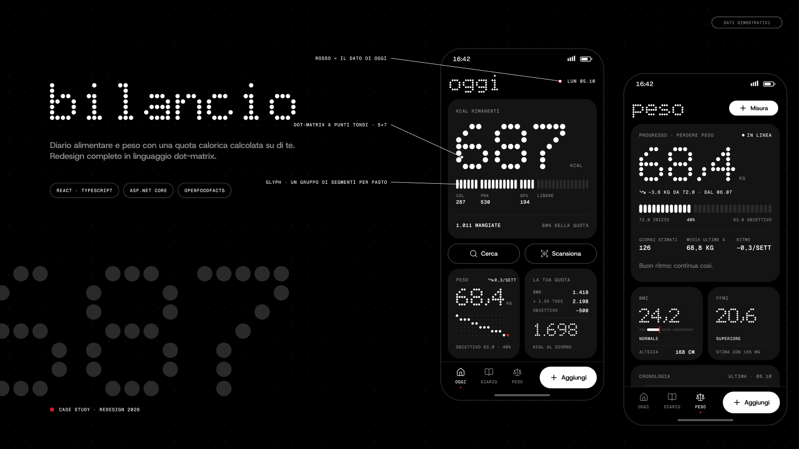
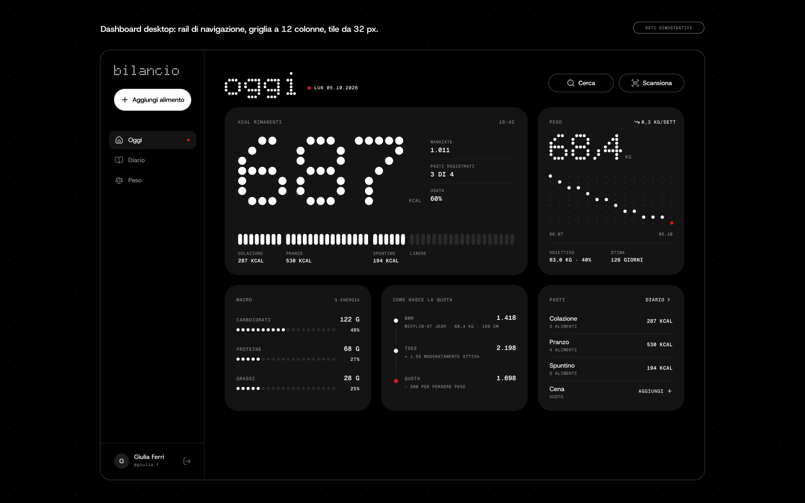
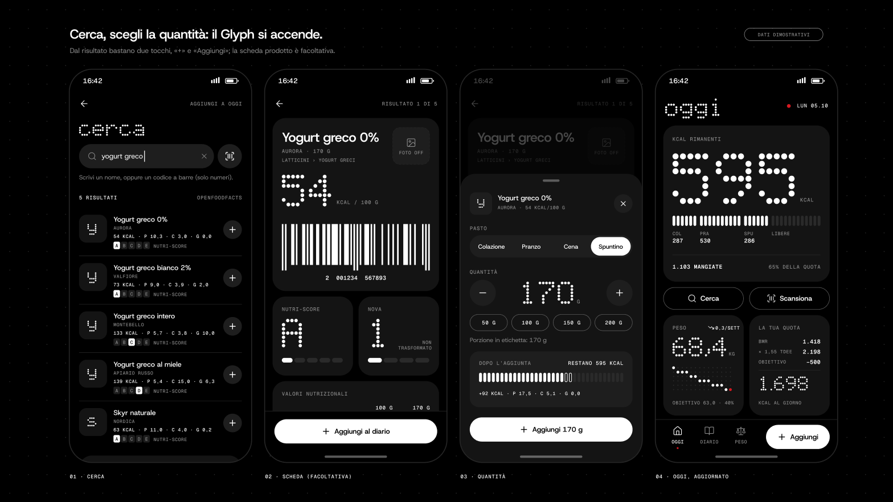

<p align="center">
  
</p>

<p align="center">
  <b>Diario alimentare e peso con una quota calorica calcolata su di te.</b><br>
  Web app full-stack · React + ASP.NET Core · prodotti da OpenFoodFacts
</p>

<p align="center">
  
  
  
  
  
  
  
</p>

---

## Cosa fa

**La quota è tua, non generica.** In registrazione Bilancio calcola il fabbisogno dal vivo mentre compili il modulo:
metabolismo basale con l'equazione di **Mifflin-St Jeor**, moltiplicato per il livello di attività (da ×1,2 a ×1,9),
poi corretto per l'obiettivo: **−500 kcal** per perdere peso, **+400 kcal** per aumentarlo.

| | |
|---|---|
| **Oggi** | Kcal rimanenti, barra a segmenti divisa per pasto, macro in % di energia e il percorso della quota: BMR → TDEE → quota. |
| **Cerca** | Ricerca per nome o per codice a barre su OpenFoodFacts, scanner con la fotocamera (con torcia dove supportata), Nutri-Score, NOVA, ingredienti e allergeni. |
| **Aggiungi** | Pasto, quantità con preset e ±10 g, anteprima di come cambia la giornata prima di confermare. |
| **Diario** | Gli alimenti di oggi divisi per pasto, con modifica, eliminazione e filtro. |
| **Peso** | Progresso verso l'obiettivo, grafico a punti su 1M · 3M · 6M · 1A, BMI con scala e FFMI. |
| **Personalizzati** | Crei un alimento con i valori dell'etichetta (calorie e macro per 100 g), salvato nel tuo database. |

Layout dedicati per telefono e desktop: barra di navigazione in basso su mobile, rail laterale e griglia a 12 colonne da 1024 px in su.

## Design

<p align="center">
  
</p>

L'interfaccia è stata progettata da zero in Figma e poi riportata nel codice, schermata per schermata.

- **Dot-matrix**: numeri e titoli sono disegnati in SVG come punti tondi su una griglia 5×7, non con un font.
- **Glyph**: la barra delle calorie è fatta di segmenti, uno per gruppo di pasto; i nuovi si accendono in sequenza.
- **Un solo colore**: nero, grigi e bianco. Il **rosso** compare solo per il dato di oggi e per i segnali da notare.
- **Tipografia**: Host Grotesk per i testi, Geist Mono per etichette e dati, entrambi self-hosted.
- **Movimento**: numeri che scorrono in 600 ms e segmenti sfasati di 60 ms, disattivati con `prefers-reduced-motion`.

Il sistema completo (colori, tipografia, componenti, regole) è in [`DESIGN.md`](DESIGN.md); utenti e principi di prodotto in [`PRODUCT.md`](PRODUCT.md).

<p align="center">
  
</p>

> Le immagini sono mockup Figma con dati dimostrativi.

## Stack

| | |
|---|---|
| **Frontend** | React 19 · TypeScript · Vite 7 · Tailwind CSS 4 · React Router 7 · lucide-react · ZXing |
| **Backend** | ASP.NET Core 8 Web API · Entity Framework Core 9 · SQL Server · BCrypt · Swagger |
| **Dati** | OpenFoodFacts per ricerca testuale e codici a barre |

## Avvio in locale

**Prerequisiti:** .NET 8 SDK · Node.js 20.19+ · SQL Server (va bene anche Express o LocalDB)

### 1. Backend

```bash
cd backend/Api
dotnet tool install --global dotnet-ef   # solo la prima volta
dotnet ef database update                # crea il database dalle migrazioni
dotnet run                               # http://localhost:5132 · Swagger su /swagger
```

La connection string è in `backend/Api/appsettings.json`. Di default punta a un'istanza locale con autenticazione Windows:

```json
"DefaultConnection": "Server=localhost;Database=TrakerAppDb;Trusted_Connection=True;TrustServerCertificate=True;"
```

Con LocalDB usa `Server=(localdb)\\mssqllocaldb;...`.

### 2. Frontend

```bash
cd tracker_app
npm install
npm run dev                              # http://localhost:5173
```

L'indirizzo del backend è in `tracker_app/src/api/APIHandler.tsx` (`endpointAPI`).

## Struttura

```
traker-app/
├── backend/Api/
│   ├── Controllers/     # food, user, weight
│   ├── Services/        # calcolo della quota, alimenti, peso
│   ├── model/Entities/  # User, Food, User_food, Misuration…
│   └── Migrations/      # EF Core
├── tracker_app/src/
│   ├── pages/           # Oggi, Cerca, Diario, Peso, Accedi, Registrati
│   ├── components/      # ui.tsx (dot-matrix, Glyph, campi, modali), Shell, schede
│   ├── api/             # client HTTP verso il backend
│   └── utils/           # BMI, FFMI, andamento del peso
├── docs/                # immagini del README
├── DESIGN.md            # design system
└── PRODUCT.md           # contesto di prodotto
```

---

<p align="center">
  Progetto di <a href="https://github.com/da4do0">@da4do0</a>
</p>
